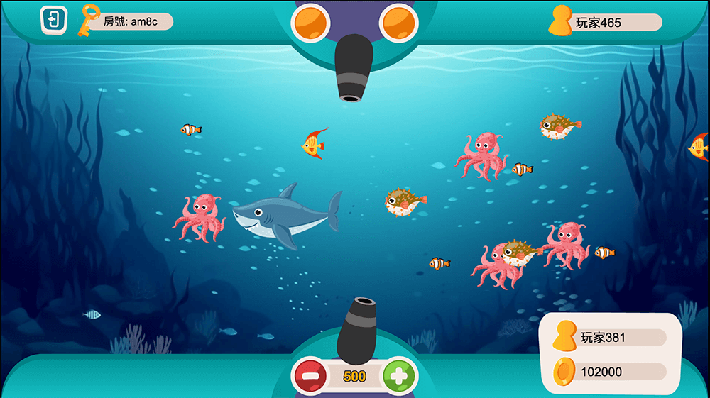

# 捕魚遊戲 DEMO

## 遊戲連結

[Demo 連結](https://shezimanor.github.io/fish-game/)

## 遊戲截圖



## 遊戲說明

本遊戲專案使用 `Cocos Creator 3.8.5` 建置。

本遊戲是一款串接 Nodejs + WebSocket 的連線捕魚遊戲 Demo，每個房間可支援兩人同時遊玩。可即時觀察同房其他玩家的動態。

開局每名玩家有 10 萬點數可以作為子彈價值使用，每射擊一次都會消耗點數，射擊方式為指向性。

子彈射中魚隻後，會由伺服器按機率決定是否中獎（並非射中即中獎），玩家會從遊戲畫面的反饋得知是否中獎，中獎後點數會立即更新在畫面上。

當點數歸零後遊戲會自動結束（強制退出房間）。

## 遊戲設定

### 魚隻設計表

| **等級** | **名稱** | **倍率** | **中獎機率** | **出現頻率** |
| -------- | -------- | -------- | ------------ | ------------ |
| 1        | 小丑魚   | 2        | 50.00%       | 60.00%       |
| 2        | 熱帶魚   | 6        | 15.00%       | 20.00%       |
| 3        | 河豚     | 15       | 6.00%        | 10.00%       |
| 4        | 章魚     | 60       | 1.50%        | 8.00%        |
| 5        | 鯊魚     | 300      | 0.30%        | 2.00%        |

### 子彈設計表

| **等級** | **子彈價值** |
| -------- | ------------ |
| Lv.1     | 100          |
| Lv.2     | 300          |
| Lv.3     | 500（預設）  |
| Lv.4     | 1000         |
| Lv.5     | 2500         |
| Lv.6     | 5000         |
| Lv.7     | 10000        |

## 腳本說明

```
- scripts/
  - types/index.d.ts     定義型別
  - GameManager.ts       遊戲總管理器，跨場景節點(含 WebSocket 的連線邏輯)
  - StartSceneManager.ts 大廳場景管理器
  - GameSceneManager.ts  遊戲場景管理器
  - AudioManager.ts      音效管理器
  - EventManager.ts      事件管理器，管理所有的腳本的事件訂閱與發佈
  - Bullet.ts            實現子彈功能
  - BulletPool.ts        管理所有子彈取用狀態的池子，即子彈物件池
  - BulletManager.ts     放置所有子彈的父節點腳本
  - Coin.ts              實現硬幣功能(硬幣是中獎時會生成的物件)
  - CoinPool.ts          管理所有硬幣取用狀態的池子，即硬幣物件池
  - CoinManager.ts       放置所有硬幣的父節點腳本
  - Fish.ts              實現魚隻功能
  - FishPool.ts          管理所有魚隻取用狀態的池子，即魚隻物件池
  - FishManager.ts       放置所有魚隻的父節點腳本
  - Gun.ts               實現槍管功能
  - Toast.ts             實現 Toast 訊息功能
```

## 遊戲限制

為了控管與限制流量，本遊戲的伺服器端有做以下限制。

1. 每個房間有限時 5 分鐘，5 分鐘一到，就會將所有玩家退出，即使仍有點數也是一樣。

2. 有同時最多房間數量限制，如遇到房間數量達到限制量時，請稍後 5 分鐘後再試。
